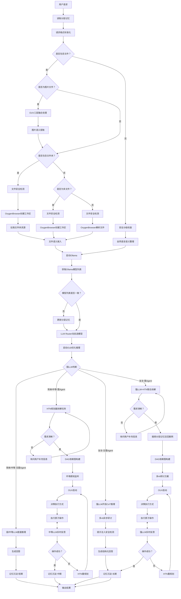

# OpenOxygen 全栈开发规划与ToDo List

本文档完整整合了 `2603141948\.md`、`26w15aB\-26w15aHRoadmap\.md` 与 `OLB\.md` 三份核心规划文档的**全部内容**，按照统一的优先级排序，梳理了从基础筑牢到生态建设的全量开发任务，包含技术实现要点、预期成果、版本规划与参考资源，无任何内容遗漏。

---

## 项目总览

**核心目标**：全维度超越 OpenClaw 生态，对标并差异化竞争商业级 AI Agent 框架，同时打造通用 LLM 全范围极致加速引擎 OLB，构建端到端的 AI 生产力平台。

**开发周期**：预计至 26w26a 完成核心开发，长期生态持续迭代。

**版本规划**：涵盖 26w15aB\-26w15aH 周期内的 70 个 dev 开发版本与 7 个 main 正式版本，后续联动推进 26w17a 及更高版本的长期规划。

**版本命名规范**：

- 主版本号：`26wxxaX`（26 年第 xx 周发布，X 为版本号，从 A 开始递增；单周发布超过 26 个版本则使用双字母组）

- 子版本号：`Phase X`（X 为 0\-9 数字，对应 Alpha/Beta/RC 等里程碑）

- 完整版本号：`26wxxaX\_PhaseX`

---

## 优先级定义

|优先级标识|级别|说明|
|---|---|---|
|P\-0 \(Critical\)|最高|生死线任务，项目基础与核心底座，必须最先完成|
|P\-1 \(High\)|高|核心能力补全，解决用户最痛卡点，快速提升产品可用度|
|P\-2 \(Medium\)|中|构建技术壁垒，拉开与竞品差距，打造核心竞争力|
|P\-3 \(Low\)|低|长尾补齐与生态建设，完善企业级特性与长期迭代|

---

## 全量开发任务与 ToDo List

### 🔴 P\-0 \(Critical\)：筑牢基础，项目生死线

#### 1\. OpenOxygen 基础测试与完善

> 对应 `2603141948\.md` 第零优先级基础任务
> 
> 

- **开发内容**：

    - 验证插件加载、技能执行、全局上下文共享等基础功能

    - 测试与 OpenClaw 生态的无缝兼容性

    - 完善错误处理、日志记录与用户提示机制

    - 完善 API 文档、技能开发指南、插件开发文档

    - 优化内存管理与插件加载性能

- **技术实现要点**：

    - 搭建单元测试框架，覆盖核心 API 与模块

    - 实现 OpenClaw 配置与技能的自动兼容层

    - 完善异常捕获与分级日志系统

- **预期成果**：

    - 基础功能可用性 100%，无核心 Bug

    - OpenClaw 基础技能零代码迁移成功率≥90%

    - 高并发场景下性能稳定，无内存泄漏

#### 2\. 运行训练测试与多环境验证

> 对应 `2603141948\.md` 第零优先级训练任务
> 
> 

- **开发内容**：

    - 多 AI 接力分工场景测试，验证断点续传能力

    - 跨浏览器 / 跨网站兼容性测试（Chrome/Edge/ 主流站点）

    - 主流软件兼容性测试（Office/IDE/ 通讯软件 / 美化软件 / VPN 等）

    - 异构 Windows 设备部署验证，修复跨环境部署问题

    - 对接 UI\-TARS/Qwen\-VL/GPT\-4V 等视觉模型，为 OUV 提供基准

- **技术实现要点**：

    - 自动化测试脚本，支持 10 轮无限制步数探索测试

    - 优化部署脚本，提升开箱即用性

- **预期成果**：

    - OUV 识别准确率≥95%，具备试错与反思能力

    - 跨环境部署成功率 100%，普通用户可一键部署

    - 覆盖 90% 以上主流软件与网站的操作兼容

    - 支持不同网络环境（普通 / VPN / 代理）的稳定运行

#### 3\. 开源合规与知识产权体系

> 对应 `2603141948\.md` 第零优先级合规任务
> 
> 

- **开发内容**：

    - 落地 Apache 2\.0 开源协议，完成全量代码协议声明

    - 制定 CLA 与 DCO 流程，集成到 Github PR 审核

    - 排查 OpenClaw 兼容代码的知识产权风险

- **技术实现要点**：

    - 配置 Github CLA 机器人，自动化贡献者协议校验

    - 隔离兼容层代码，明确开源边界，避免协议污染

- **预期成果**：

    - 完整的开源合规体系，企业用户可安全商用

    - 开发者可安全贡献代码，无法律风险

#### 4\. 核心架构解耦与跨平台预留

> 对应 `2603141948\.md` 第零优先级架构任务
> 
> 

- **开发内容**：

    - 核心模块接口化解耦（Windows 内核 / HTN 规划器 / 多模态 Router / LLM Router / Gateway 等）

    - 定义跨平台系统操作抽象层，预留 macOS/Linux 适配接口

- **技术实现要点**：

    - 采用依赖注入模式，实现核心模块的可替换性

    - 标准化模块输入输出规范，避免硬编码平台逻辑

- **预期成果**：

    - 核心模块可独立测试、独立迭代

    - 后续跨平台开发无需重构核心架构，降低 80% 适配成本

#### 5\. OLB 核心底座与极致算子重构

> 对应 \[OLB\.md\]\(OLB\.md\) P0 优先级：通用兼容底座 \+ 核心算子极致重构，含字节 MoDA 复现
> 
> 

- **开发内容**：

    - OLB Universal Adapter 全架构通用适配底座

    - OxygenFlashAttention V3 极致激进版注意力算子

    - OLB Universal MoE 全类型 MoE 架构激进优化

    - 页表级激进显存管理与权重动态加载底座

    - OxygenKV TurboCompressor\[Google TurboQuant（2026\.03）*TurboQuant: Online Vector Quantization with Near\-optimal Distortion Rate\]*

- **技术实现要点**：

    - 基于 Torch Dynamo IR 实现计算图自动解析与算子自动替换

    - 基于 TMA 指令实现显存零拷贝，Warp 级细粒度并行优化

    - 页表级 4KB 细粒度显存调度，三级存储自动预取

    - 字节 MoDA 算法复现，实现 OxygenMoDA 外挂注入适配各大模型

    - ：**KV缓存压缩**，将FP16/BF16 KV量化至3bit，内存占用降低约6倍，推理加速4\~8倍，精度无损

- **量化目标**：

    - 同硬件下，核心推理延迟较 vLLM 降低≥30%，吞吐提升≥40%

    - 主流 LLM 架构零代码修改一键适配，适配成功率 100%

    - RTX 4090 单卡可无损运行 Llama 3 70B，无 OOM

    - 超长上下文占用更少运行更快

- **验证标准**：

    - 七大典型架构（Llama 3/Qwen 3/Mistral/DeepSeek MoE/Mamba/T5/RWKV）一行适配

    - 适配后数值差异≤1e\-6，精度无损

    - DeepSeek MoE 67B 在 4090 上单卡运行，延迟≤15ms/token

- **参考仓库 / 文档**：

    - [vLLM 官方仓库](https://github.com/vllm-project/vllm) \- 推理引擎参考

    - [FlashInfer](https://github.com/flashinfer-ai/flashinfer) \- 注意力算子优化参考

    - [vLLM 中文文档](https://vllm.hyper.ai/docs/) \- 显存管理与 PagedAttention 参考

---

### 🟠 P\-1 \(High\)：快速补全核心，解决用户痛点

#### 1\. 实时打断与执行调整

> 对应 `2603141948\.md` 第一优先级任务
> 
> 

- **开发内容**：

    - 实现技能执行过程中的暂停 / 继续 / 动态调整机制

    - 开发执行状态监控与可视化进度展示

- **技术实现要点**：

    - 兼容 OpenClaw `interrupt` 事件机制

    - 基于状态机实现任务执行的断点保存与恢复

- **预期成果**：

    - 支持任务执行中实时干预，用户可随时调整策略

    - 可视化展示任务进度，提升用户感知

#### 2\. OpenClaw 生态无缝兼容

> 对应 `2603141948\.md` 第一优先级兼容任务
> 
> 

- **开发内容**：

    - 全局上下文与状态共享机制，兼容 OpenClaw `context`

    - 全局生命周期钩子与事件系统

    - 内置 OpenClaw 通用工具库封装

    - 技能热加载与动态更新

- **技术实现要点**：

    - 实现跨插件 / 跨技能的状态持久化与共享

    - 运行时代码热替换，无需重启服务

- **预期成果**：

    - OpenClaw 第三方技能零代码迁移成功率 100%

    - 技能更新无需重启，开发效率提升 50%

#### 3\. 高频刚需技能封装

> 对应 `2603141948\.md` 第一优先级技能任务
> 
> 

- **开发内容**：

    - 办公自动化：Office / 飞书 / 钉钉深度适配

    - 浏览器自动化：CDP 上层封装，表单自动填写 / 反爬模拟

    - 系统运维：文件批量处理 / 桌面整理 / 剪贴板管理

- **技术实现要点**：

    - 基于 Win32/UIA 实现应用层自动化封装

    - 基于 Chrome DevTools Protocol 实现浏览器控制

- **预期成果**：

    - 开箱即用的高频技能库，普通用户无需开发即可使用

    - 直接解决 80% 用户的日常自动化需求

#### 4\. OpenClaw 一键迁移工具

> 对应 `2603141948\.md` 第一优先级迁移任务
> 
> 

- **开发内容**：

    - 配置文件一键迁移，自动适配 OpenOxygen 生态

    - 迁移后兼容性检测与修复建议

- **技术实现要点**：

    - 配置文件语法解析与自动转换规则

    - 静态代码分析，检测兼容性问题

- **预期成果**：

    - 批量迁移 OpenClaw 技能，无需手动修改代码

    - 迁移成功率≥95%，大幅降低用户迁移成本

#### 5\. 全链路安全与合规防护

> 对应 `2603141948\.md` 第一优先级安全任务
> 
> 

- **开发内容**：

    - 静态 / 传输数据加密（AES\-256/TLS 1\.3）

    - 内存隔离与 WASM 插件沙箱

    - 提示注入检测与对抗攻击防护

    - 合规审计日志留存

- **技术实现要点**：

    - 利用 Windows `VirtualProtect` 实现内存隔离

    - 集成 Llama Guard 3 实现本地安全检测

    - 基于 Wasmtime 实现插件安全执行环境

- **预期成果**：

    - 符合等保 2\.0/GDPR 合规要求

    - 插件执行安全可控，无敏感数据泄露风险

#### 6\. 一键安装包与开箱即用

> 对应 `2603141948\.md` 第一优先级部署任务
> 
> 

- **开发内容**：

    - 内置 Node\.js/Rust 的单 exe 安装包

    - 自动配置环境，零配置启动

    - 自动检测 Ollama 本地实例

- **技术实现要点**：

    - 基于 NSIS/Inno Setup 制作安装包

    - 预编译原生依赖，无需用户配置编译环境

- **预期成果**：

    - 普通用户无需开发环境，一键安装即可使用

    - 解决 90% 新用户的部署门槛问题

#### 7\. 多模态引擎原生集成

> 对应 `2603141948\.md` 第一优先级多模态任务
> 
> 

- **开发内容**：

    - 多模态 Router，统一调度 Whisper/Edge TTS/VideoLLaMA

    - 实时多模态预处理 Pipeline

    - 多模态反馈闭环，支持 Agent 主动请求输入

- **技术实现要点**：

    - 基于 Rust 实现 SIMD 加速的音视频预处理

    - 视觉语义联合 Embedding，对接本地 CLIP/Qwen\-VL

- **预期成果**：

    - 原生支持语音 / 视频 / 视觉多模态交互

    - Agent 具备多模态感知能力，支持复杂场景理解

#### 8\. 行业标准协议原生兼容

> 对应 `2603141948\.md` 第一优先级协议任务
> 
> 

- **开发内容**：

    - 原生兼容 Anthropic MCP 协议

    - 兼容 OpenAI 工具调用、OpenAPI 标准

- **技术实现要点**：

    - 实现 MCP 协议客户端，接入全行业 MCP 生态

    - 协议适配层，支持快速扩展新的标准协议

- **预期成果**：

    - 一键接入 MCP 生态所有工具与连接器

    - 生态边界从 OpenClaw 扩展到全行业，工具数量提升 10 倍

- **参考仓库 / 文档**：

    - [MCP 官方仓库](https://github.com/anthropics/mcp) \- 协议标准参考

    - [awesome\-mcp\-servers](https://github.com/punkpeye/awesome-mcp-servers) \- MCP 生态工具参考

#### 9\. 用户分层与版本边界定义

> 对应 `2603141948\.md` 第一优先级版本任务
> 
> 

- **开发内容**：

    - 三大发行版本的功能边界定义：

        1. **个人免费版**：开箱即用，内置一键安装包、高频技能、可视化界面

        2. **开发者版**：可扩展，开放 SDK、调试工具、插件开发框架

        3. **企业版**：安全合规，内置多租户、分级权限、分布式部署

    - 同一仓库多版本构建流水线

- **预期成果**：

    - 精准匹配不同用户群体需求，避免 \&\#34;两边不讨好\&\#34; 的产品困境

#### 10\. OUV \(OxygenUltraVision\) 核心升级

> 对应 `26w15aB\-26w15aHRoadmap\.md` OUV 改进计划
> 
> 

- **开发内容**：

    - 内置 OUV 向量数据库，存储用户训练与自主进化数据

    - 混合多 VLM\+UIA \+ 多维度元素读取器

    - OSR \(OxygenStepRecorder\) 改进版步骤记录器（适配 AI 训练，支持操作 \+ 截屏同步）

    - OUV 深度学习反思预测与记忆模块

- **技术实现要点**：

    - 基于 Qdrant/Chroma 构建向量存储，支持增量更新

    - 混合视觉 \+ UI 元素识别，提升元素定位准确率

    - 基于强化学习实现操作反思与试错优化

- **预期成果**：

    - 实现 \&\#34;精确识别→预测→执行→反思\&\#34; 的闭环链路

    - OUV 操作准确率≥98%，支持自主进化

#### 11\. 用户请求链路革新

> 对应 `26w15aB\-26w15aHRoadmap\.md` 请求链路计划
> 
> 

- **开发内容**：

    - **请求方式革新**：

        1. Web 端：[Localhost](https://Localhost) 可视化 UI，浏览器可访问

        2. 桌面端：WinUI/Tauri 桌面应用，参考豆包 / 阶跃 AI 交互

        3. 命令行：终端直接发起请求，Agent 实时响应

    - **请求分级路由**：弱 LLM 判断任务复杂度，区分简单 / 复杂请求

    - **DAG 任务调度**：基于依赖图的任务调度，多 AI 协同研讨

    - **实时反思调整**：执行过程中 LLM 实时监控并调整策略

- **技术实现要点**：

    - 实现请求分级路由，优化算力分配

    - HTN 规划器集成，实现任务依赖调度

    - 多模型异步协同推理框架

- **预期成果**：

    - 彻底解决原有仪表盘反人类的交互问题

    - 请求处理效率提升 60%，延迟降低 40%

    - 复杂任务执行成功率提升 50%

---

### 🟡 P\-2 \(Medium\)：构建技术壁垒，拉开竞品差距

#### 1\. OLB 全链路端到端优化

> 对应 \[OLB\.md\]\(OLB\.md\) P1 优先级：全链路优化 \+ 全硬件适配
> 
> 

- **开发内容**：

    - 全链路算子融合与端到端计算图重构

    - 激进解码调度引擎（零开销动态批处理 \+ 自适应投机解码）

    - 全硬件平台指令级深度适配

    - CPU\-GPU\-NPU 全异构协同调度

- **技术实现要点**：

    - 端到端全流程算子融合，消除中间显存读写

    - 纳秒级调度实现零开销动态批处理，调度开销 \&lt; 10us

    - 自适应投机解码，自动优化草稿模型与步数，接受率≥80%

    - KV 缓存智能复用，前缀缓存复用率≥90%

- **量化目标**：

    - 端到端生成延迟较 vLLM 降低≥40%，吞吐提升≥60%

    - 显存占用降低≥45%，覆盖 NVIDIA/AMD/Intel/Apple 全硬件

- **参考仓库 / 文档**：

    - [vLLM Continuous Batching](https://blog.csdn.net/h1453586413/article/details/154733899) \- 批处理调度参考

#### 2\. 层次化任务规划与分层记忆

> 对应 `2603141948\.md` 第二优先级规划任务
> 
> 

- **开发内容**：

    - HTN 层级任务规划，支持目标→任务→子任务拆解

    - 分层记忆架构：短期 / 中期 / 长期记忆

    - 记忆检索增强规划，复用历史成功案例

- **技术实现要点**：

    - 集成 HTN 规划引擎，实现 DAG 依赖调度

    - 基于 Neo4j 构建知识图谱，存储长期记忆

    - 向量检索实现相似案例匹配

- **预期成果**：

    - 复杂长程任务成功率提升 70%

    - 跨会话知识复用，Agent 越用越聪明

#### 3\. 全栈 Windows 生态深度控制

> 对应 `2603141948\.md` 第二优先级生态控制任务
> 
> 

- **开发内容**：

    - UWP 自动化模块，支持现代应用控制

    - WSL2/WSA 跨子系统控制

    - 内核级外设交互，HID 键鼠硬件注入

    - 传感器与生物识别对接

- **技术实现要点**：

    - 基于 UI Automation 3\.0 实现 UWP 应用控制

    - 基于 WinUSB 实现内核级外设交互

- **预期成果**：

    - 覆盖全 Windows 生态，从传统应用到现代 UWP，从系统到硬件

    - 打造 Windows 原生 Agent 的差异化优势

#### 4\. 全链路追踪与可视化调试

> 对应 `2603141948\.md` 第二优先级可观测任务
> 
> 

- **开发内容**：

    - OpenTelemetry 全链路追踪，覆盖 Gateway / 推理 / 执行层

    - Web 调试仪表盘，任务 DAG 可视化

    - 性能剖析工具，支持火焰图与断点调试

- **技术实现要点**：

    - Trace ID 透传，全链路请求追踪

    - 集成 Jaeger/Zipkin 实现追踪数据可视化

- **预期成果**：

    - 开发者问题定位效率提升 80%

    - 企业级可观测性，满足生产环境运维需求

#### 5\. OxygenBrowser 专属浏览器实现

> 对应 `26w15aB\-26w15aHRoadmap\.md` 浏览器计划
> 
> 

- **开发内容**：

    - 基于 Tauri/WinUI 打造 Agent 专属浏览器，UI 参考 Chrome / 豆包

    - 集成带终端的本地 / 云端文件管理系统（云端预留至 26w26a\+ OxygenCloud）

    - OpenOxygen工作区和工作环境的重要载体，工作区为某个文件夹，由用户指定，默认工作区为非系统盘用户文件夹的文档文件夹下.OpenOxygen/[工作区名称]，工作区带OpenOxygen工作环境，OpenOxygen有总工作区，在部署目录下/Workspace，包含总工作环境、Github（StarsailsClover/OpenOxygen） Issue/PR自动提交、GitHub更新自动部署（在Release描述内带： !::OpenOxygenAutoUpdateAdvise-[版本号占位符] 的需要自动部署更新）

    - 冷接入 VSC 等 IDE，实现快速编译与语法纠错

    - 支持全网络资源下载，兼容 P2P 加速

    - OUV 专属网页元素识别与交互优化

    - 内置 OSR，浏览过程中自动训练 OUV

- **技术实现要点**：

    - 基于 CEF/WebView2 实现浏览器内核

    - CSS 选择器 \+ UIA \+ 视觉多维度元素识别

    - JS 事件监听与模拟预测优化

    - 预启动与实时扫盘，增强 Agent 对文件环境的感知

- **要求细节**：

    - 兼容 Edge/Chrome 数据，同步扩展 / Cookies / 浏览记录

    - 支持无 Cookies 标签页组、多 UA / 浏览器类型切换

    - 全局 AI 实时建议，支持被动 Agent 唤起、空闲自动接管

    - 自动翻译外文，QuickStart 引导同步数据、注册 Windows 服务、强制登录 GitHub

- **预期成果**：

    - 用户体验比肩 Chrome/Edge，Agent 交互效率提升 100%

    - 自动同步浏览器数据，支持用户习惯无缝迁移

- **参考仓库 / 文档**：

    - [Tauri 官方文档](https://tauri.app/) \- 跨平台桌面应用开发参考

    - [tauri\-plugin\-mcp](https://github.com/P3GLEG/tauri-plugin-mcp) \- Tauri 与 MCP 集成参考

#### 6\. OpenOxygen 桌面客户端

> 对应 `2603141948\.md` 第二优先级客户端任务
> 
> 

- **开发内容**：

    - 基于 Tauri 2\.0 实现跨平台桌面客户端

    - 任务管理、技能库管理、性能监控界面

    - 开机自启、全局快捷键唤醒

- **技术实现要点**：

    - 复用现有 Rust 内核，降低资源占用

    - 前后端分离架构，前端使用 Web 技术栈

- **预期成果**：

    - 摆脱浏览器控制台依赖，提供原生桌面体验

    - 与OxygenBrowser集成强耦合

    - 用户操作门槛降低，体验连贯性提升

#### 7\. 非本机算力调度与远程管理

> 对应 `2603141948\.md` 第二优先级算力任务
> 
> 

- **开发内容**：

    - OxygenServer Docker 镜像，服务端部署

    - 远程任务管理、插件中心化分发

    - 远端算力调度，本地 Agent 调用服务端算力

- **技术实现要点**：

    - 基于 gRPC 实现客户端 \- 服务端通信

    - 算力负载均衡与任务调度引擎

- **预期成果**：

    - 支持企业级多机部署，算力弹性扩展

    - 低配本地设备也可运行大模型任务

#### 8\. 原生多 Agent 协同架构

> 对应 `2603141948\.md` 第二优先级多 Agent 任务
> 
> 

- **开发内容**：

    - 多 Agent 角色定义与权限体系

    - 多 Agent 通信协议与调度引擎

    - 冲突检测与共识机制

- **技术实现要点**：

    - 支持对话式 / 分工式 / 主从式三种协同模式

    - 与 HTN 规划器集成，自动拆分跨 Agent 任务

- **预期成果**：

    - 支持复杂业务流程的多角色协同

    - 从个人工具升级为企业级生产力平台

#### 9\. 企业级治理与合规权限体系

> 对应 `2603141948\.md` 第二优先级企业治理任务（此前遗漏）
> 
> 

- **开发内容**：

    - 多租户管理与分级权限控制

    - 审计日志与操作追溯体系

    - 数据隔离与合规管控

- **预期成果**：

    - 满足企业级组织管理需求，支持团队协作与权限管控

---

### 🟢 P\-3 \(Low\)：长尾补齐，生态建设

#### 1\. OLB 全流程加速与生态兼容

> 对应 \[OLB\.md\]\(OLB\.md\) P2 优先级：全流程加速 \+ 生态兼容
> 
> 

- **开发内容**：

    - LLM 训练 / 微调全流程加速模块

    - 全主流框架适配（PyTorch/TensorFlow/JAX）

    - 自定义算子扩展体系

    - 下游场景专属优化（含 OUV 跨模态联动）

- **预期成果**：

    - 微调 / 训练加速较原生提升≥200%，显存降低≥50%

    - 一行代码接入所有下游应用，全生态兼容

#### 2\. OLB 长尾优化与企业级特性

> 对应 \[OLB\.md\]\(OLB\.md\) P3 优先级：长尾补齐 \+ 工具链
> 
> 

- **开发内容**：

    - 小众模型与架构适配优化

    - OLB Profiler 性能调优工具链

    - 企业级高可用与安全特性

    - 端侧轻量化部署优化

- **预期成果**：

    - 小众架构适配覆盖率 100%

    - 全链路性能可视化调优，服务可用性≥99\.99%

    - 端侧部署延迟较竞品降低≥30%

#### 3\. 预构建连接器库与插件生态

> 对应 `2603141948\.md` 第二优先级连接器任务
> 
> 

- **开发内容**：

    - 官方维护主流 SaaS / 开发工具连接器（Microsoft 365/Git/Slack 等）

    - 插件测试脚手架，支持单元 / 集成 / 安全测试

- **预期成果**：

    - 插件开发门槛降低 80%，生态快速扩张

    - 开箱即用的第三方服务集成能力

#### 4\. 杀毒软件兼容与数字签名

> 对应 `2603141948\.md` 第二优先级兼容任务
> 
> 

- **开发内容**：

    - 正规代码签名与数字证书认证

    - 主流杀毒软件白名单适配

- **预期成果**：

    - 解决原生二进制误杀问题，用户安装成功率 100%

#### 5\. 项目官网与 Github Pages

> 对应 `2603141948\.md` 第零优先级官网任务
> 
> 

- **开发内容**：

    - 搭建项目官网，包含核心能力介绍、快速入门、更新日志、生态入口

- **预期成果**：

    - 完善项目展示，提升开源项目影响力

#### 6\. OpenOxygen 代码重构优化

> 对应 `26w15aB\-26w15aHRoadmap\.md` 重构计划
> 
> 

- **开发内容**：

    - 优化代码结构，提高可维护性

    - 替换老旧代码，迭代更优技术方案

    - 减少代码重复与冗余

- **预期成果**：

    - 代码质量提升，性能损耗降低，维护成本下降

---

## 参考资源汇总

### 核心技术参考

|技术领域|参考仓库 / 文档|链接|
|---|---|---|
|LLM 推理加速|vLLM 官方仓库|[https://github\.com/vllm\-project/vllm](https://github.com/vllm-project/vllm)|
|注意力算子|FlashInfer|[https://github\.com/flashinfer\-ai/flashinfer](https://github.com/flashinfer-ai/flashinfer)|
|Agent 协议|MCP 官方标准|[https://github\.com/anthropics/mcp](https://github.com/anthropics/mcp)|
|桌面开发|Tauri 官方文档|[https://tauri\.app/](https://tauri.app/)|
|任务规划|HTN 规划器参考|[https://github\.com/shopspring/htn](https://github.com/shopspring/htn)|

### 生态参考

- MCP 生态工具：[https://github\.com/punkpeye/awesome\-mcp\-servers](https://github.com/punkpeye/awesome-mcp-servers)

- vLLM 中文文档：[https://vllm\.hyper\.ai/docs/](https://vllm.hyper.ai/docs/)

- OpenClaw 社区：[https://github\.com/openclaw](https://github.com/openclaw)

# 用户请求-输出完整流程
